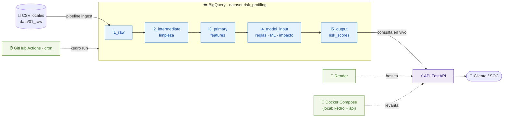

# 🛡️ User Risk Profiling (UEBA)


Sistema que detecta comportamientos anómalos y calcula un **risk score por usuario** a
partir de inventario de usuarios, permisos y logs de acceso. Combina **reglas duras
deterministas** (mapeadas a MITRE ATT&CK) con un **ensemble de Machine Learning no
supervisado**, y modula el resultado por el **impacto** (blast radius) de cada usuario.

🌐 **Backend desplegado:** https://risk-profiling-api.onrender.com — doc interactiva en
[`/docs`](https://risk-profiling-api.onrender.com/docs)
*(plan free: la primera petición tras 15 min inactivo tarda ~30–60s por cold start)*

📄 **Diseño detallado del modelo:** [`docs/MODELO_RIESGO.md`](docs/MODELO_RIESGO.md)

---

## 📑 Índice

1. [Arquitectura](#-arquitectura)
2. [Cómo correr el proyecto](#-cómo-correr-el-proyecto)
3. [Flujo de datos y capas](#-flujo-de-datos-y-capas)
4. [El modelo de scoring](#-el-modelo-de-scoring)
5. [Métricas del modelo](#-métricas-del-modelo)
6. [La API REST](#-la-api-rest)
7. [Hallazgos principales](#-hallazgos-principales)
8. [Decisiones de modelado](#-decisiones-de-modelado)
9. [Limitaciones](#-limitaciones)
10. [Monitoreo en producción](#-monitoreo-en-producción)

---

## 🏗 Arquitectura



**Componentes:**
- **Kedro** — pipelines reproducibles que limpian, generan features y calculan el score.
- **BigQuery (Sandbox)** — almacena todo el flujo de datos en capas (free tier, sin tarjeta).
- **FastAPI** — expone el score por usuario; consulta BigQuery en vivo.
- **Docker Compose** — corre pipeline + API localmente, conectados a BigQuery.
- **GitHub Actions** — corre el pipeline en cron y refresca las tablas.
- **Render** — hostea la API con auto-deploy en cada push.

---

## 🚀 Cómo correr el proyecto

### Requisitos previos
1. **Llave de BigQuery** (la comparte el dueño del repo): guardala en
   **`conf/local/gcp-key.json`**. El PROJECT_ID ya está configurado en
   `conf/base/globals.yml`, no hay que tocar nada más.
2. **Docker** (recomendado) o **Python 3.12** (`pip install -r requirements.txt`).

### Opción A — con Docker (recomendado)

Construye las imágenes y levanta los servicios:

```bash
docker compose up --build            # construye y levanta: pipeline (kedro) + API
docker compose up --build api        # solo la API → http://localhost:8000
```

Ejecutar pipelines (sin afectar la API que está corriendo):

```bash
docker compose run --rm kedro kedro run                    # proceso completo (sin ingesta)
docker compose run --rm kedro kedro run --pipeline=ingest  # subir CSV local → BigQuery
docker compose run --rm kedro kedro run --pipeline=full    # ingesta + proceso completo
docker compose run --rm kedro bash                         # shell interactiva
```

> El código se **copia** a la imagen → tras cambiar código corré `docker compose build`.
> Los **datos** (`data/`) y las **credenciales** (`conf/local/`) van por volumen → no
> requieren rebuild.

### Opción B — sin Docker

```bash
pip install -r requirements.txt
kedro run --pipeline=ingest    # carga inicial de los CSV a BigQuery
kedro run                      # proceso completo
cd api && uvicorn main:app --reload   # API en http://localhost:8000
```

### Pipelines disponibles

| Comando | Qué hace | Nodos |
|---|---|---|
| `kedro run` | Proceso completo **sin** ingesta (lee raw de BQ) | 9 |
| `kedro run --pipeline=ingest` | Sube los CSV locales a BigQuery | 3 |
| `kedro run --pipeline=full` | Ingesta + proceso completo | 12 |
| `kedro run --tags=train` / `--tags=score` | Solo entrenar / solo scorear | — |

> La orquestación (GitHub Actions, cron) y el deploy de la API (Render) ya están
> configurados por el dueño del repo — no hace falta montarlos para correr el proyecto.

---

## 🗂 Flujo de datos y capas

Los datos atraviesan **5 capas** (convención de data engineering de Kedro), todas en el
dataset `risk_profiling` de BigQuery con prefijo `l1`–`l5` para agruparse en la consola:

| Capa | Prefijo | Tablas | Qué contiene |
|---|---|---|---|
| **Raw** | `l1_` | user_inventory, permission_inventory, access_logs | Datos fuente sin procesar |
| **Intermediate** | `l2_` | users_clean, perms_clean, logs_clean | Limpios: tipos, fechas, outliers de sesión capados al p99, validación de dominios |
| **Primary** | `l3_` | user_features | 17 features numéricas por usuario (volumetría, z-scores vs peers, comportamiento, criticidad) |
| **Model input** | `l4_` | hard_rule_scores, anomaly_scores, impact_scores | Salidas de cada capa del modelo |
| **Output** | `l5_` | risk_scores | Score final, categoría y señales por usuario |

El **modelo entrenado** (`anomaly_ensemble.pkl`) queda local en `data/06_models/` — BigQuery
no almacena binarios.

**Pipelines de Kedro que producen estas capas:**
- `ingest` → escribe `l1_*` (CSV local → BQ)
- `data_processing` → `l1` → `l2`
- `risk_scoring` → `l2` → `l3` → `l4` → `l5`

### Limpieza de datos (capa l2 · pipeline `data_processing`)

Antes de modelar, cada dataset raw se limpia y valida. Todo descarte se **registra en el log**
con su conteo (auditoría):

- **Espacios en blanco** → se quitan de todos los campos de texto.
- **Duplicados** → se eliminan filas repetidas exactas.
- **Fechas** → se parsean y estandarizan (`created_at`, `assigned_at`, `expires_at`, `timestamp`).
- **Filas inválidas que se descartan:**
  - Valores fuera de dominio: `user_type`/`status`, `criticality`, `action`/`resource_type`.
  - Claves nulas: `user_id`, `resource_id`.
  - Timestamps no parseables (en logs).
  - Permisos con `expires_at < assigned_at` (fecha inconsistente).
- **Outliers** → `session_duration_sec` se capa al **p99** (techo, recorta valores extremos que
  distorsionarían el modelo) y a **0** (piso, recorta negativos corruptos).
- **Flags de calidad** → se agregan `has_manager` y `has_expiry` para uso aguas abajo.

> En los datos actuales no hay duplicados ni valores corruptos, así que la limpieza no
> descarta nada — pero está hecha para ser **robusta** si llegan datos sucios en producción.

---

## 🧮 El modelo de scoring

Arquitectura **híbrida de dos capas** + modulación por impacto:

```
base   = clip(rule_score[0-60] + anomaly_score[0-40], 0, 100)
final  = base × (0.7 + 0.3 × impacto)
si el usuario es Inactive con accesos (R2): final = max(final, 85), categoría = VERY_HIGH
```

**¿Por qué se suman las dos capas (reglas + ML)?** Porque detectan cosas **distintas e
independientes**: las reglas atrapan violaciones claras de política (R1, R2, …), el ML atrapa
comportamiento **inusual** que ninguna regla cubre. Sumarlas hace que **cualquiera de las dos
pueda levantar la alarma por su cuenta**:
- Rompió una regla pero se comporta normal → igual sube, por la Capa 1.
- No rompió ninguna regla pero se comporta rarísimo → igual sube, por la Capa 2.
- Las dos cosas a la vez → se refuerzan y suman más.

Si en cambio **multiplicáramos** las capas, haría falta que **ambas** fueran altas: un usuario
muy anómalo que no rompió ninguna regla daría `0 (reglas) × algo = 0` y **se nos escaparía**.
Por eso sumamos. Los topes (60 para reglas, 40 para ML) le dan un poco más de peso a las
reglas —que son más confiables— pero dejan que el ML, **solo con comportamiento**, pueda
empujar a alguien hasta MEDIUM/HIGH.

### Capa 1 — Reglas duras (0–60 pts)
Son reglas **deterministas**: blanco o negro, sin zona gris. La condición se cumple o no se
cumple — no hay probabilidad ni aprendizaje. Por ejemplo R2 pregunta *"¿el usuario está dado
de baja Y tiene accesos registrados?"*: si la respuesta es sí, la regla **dispara**, punto.
Codifican violaciones que un experto en seguridad marcaría de inmediato, con **casi cero
falsos positivos** y de forma totalmente **explicable** (podés decir exactamente qué política
rompió). Es la contracara de la Capa 2 (ML), que mide "qué tan raro" en escala de grises.

Cada regla está mapeada a una técnica de **MITRE ATT&CK** (el catálogo estándar de la
industria sobre tácticas de atacantes):

| Regla | Detecta | Peso | MITRE |
|---|---|---:|---|
| R1 | Acceso sin permiso asignado | 30 | T1078 |
| R2 | Usuario inactivo con accesos (fuerza VERY_HIGH) | 45 | T1078.001 |
| R3 | Acceso con permiso expirado | 20 | T1078 |
| R4 | Privilege escalation (criticidad > permisos) | 30 | T1548 |
| R5 | Externo con VERY_HIGH sin vencimiento | 15 | T1098 |
| R6 | Acceso a recurso fuera del perfil del depto | 20 | T1021 |
| R7 | Externo con ratio accesos/permiso anómalo | 20 | T1078.004 |

**¿Por qué se suman los puntos?** Cada regla que dispara **suma** su peso: más violaciones =
más riesgo. La idea es **acumular evidencia** — un usuario que accede sin permiso (R1) *y*
además escala privilegios (R4) es más riesgoso que uno que solo hace una de las dos, así que
sus puntos se acumulan (30 + 30). Ventajas de sumar frente a otras opciones:
- Es **transparente y auditable**: "te dio 30 por R1 + 20 por R6 = 50", fácil de explicar.
- Es el enfoque estándar de los SIEM/UEBA comerciales (Splunk, Elastic suman "risk points").
- No usamos el **máximo** (ignoraría que hubo varias violaciones) ni la **multiplicación**
  (un solo 0 borraría todo y los números se disparan).
- El total se **topa en 60** para que las reglas no dominen el score y quede espacio (40) para
  la señal del modelo de ML. *(El override de R2 es la excepción: una cuenta inactiva en uso
  va directo a VERY_HIGH, sin importar lo demás.)*

Los pesos (45, 30, 20, 15) son **juicio experto** según severidad × confianza, no una fórmula
mágica — y demostramos que el ranking **aguanta cambiarlos ±50%** (ver Métricas).

### Capa 2 — Ensemble no supervisado (0–40 pts)
Promedio de tres detectores de familias distintas (robusto a la elección de algoritmo):
**Isolation Forest** (particiones) + **LOF** (densidad) + **Z-score sum** (distancia).

**¿Por qué solo se "entrena" uno de los tres?** De los tres, únicamente el **Isolation
Forest** aprende algo que valga la pena guardar (una estructura de árboles), así que se
entrena una vez y se persiste en `data/06_models/anomaly_ensemble.pkl`. Los otros dos **no
tienen un "modelo" que guardar** — se calculan al vuelo cada vez sobre los datos del momento:
- **Z-score** solo necesita el promedio y la desviación de la población; ese cálculo ya se
  guarda junto al Isolation Forest (en el *scaler*), no hay nada más que entrenar.
- **LOF** compara a cada usuario contra sus vecinos **dentro del lote que se está puntuando**;
  no genera un modelo reutilizable. Recalcularlo es además lo **correcto**: si lo
  "congeláramos", al puntuar a los mismos usuarios con que se entrenó daría puntajes sesgados.

Como el pipeline corre los tres juntos en cada ejecución, el resultado es el mismo: el
ensemble combina los tres aunque en disco solo quede uno.

### Modulación por impacto (blast radius)
`impacto ∈ [0,1]` = criticidad máxima (permisos ∪ accesos) + amplitud de recursos HIGH+.
El multiplicador `0.7 + 0.3·impacto` amortigua hasta un 30% a usuarios de baja criticidad,
sin enterrar comportamiento anómalo.

### Categorías
`LOW ≤ 28 < MEDIUM ≤ 46 < HIGH ≤ 64 < VERY_HIGH`

> Detalle completo, justificación de cada peso y referencias (NIST 800-30, FAIR, CVSS) en
> [`docs/MODELO_RIESGO.md`](docs/MODELO_RIESGO.md).

---

## 📊 Métricas del modelo

El modelo **no tiene una "respuesta correcta"** contra la cual compararse: nadie en los datos
está etiquetado como atacante confirmado. Por eso, en vez de medir "aciertos", respondemos
preguntas prácticas sobre si el modelo es **confiable y útil**:

| Pregunta | Métrica (valor) | En palabras simples |
|---|---|---|
| ¿Da el mismo resultado si lo corro varias veces? | **Estabilidad del ranking** · Spearman = 0.99 | **Sí**, casi idéntico. El ranking no depende del azar. |
| ¿La lista de "más riesgosos" se mantiene estable? | **Estabilidad del top-20** · Jaccard = 0.88 | **Sí**, el top-20 casi no cambia entre corridas. Es la lista que revisaría seguridad, así que importa que sea confiable. |
| ¿Está apuntando a los usuarios correctos? | **Lift@5%** = 3.7× | **Sí**: entre los que marca como más riesgosos hay **~4× más casos sospechosos** que eligiendo al azar. |
| ¿Es un invento de un solo algoritmo? | **Consenso multi-método** = 13/25 | **No**: 3 métodos distintos (Isolation Forest, LOF, Z-score) **coinciden en más de la mitad** de los más riesgosos. |
| ¿Funciona con datos que no vio antes? | **Lift held-out** · 3.7× → 3.1× | **Sí**, casi igual: acierta un poco menos, una caída esperable que medimos para ser honestos. |
| ¿El resultado depende de los números que elegimos? | **Sensibilidad de pesos** · ±50% | **No**: aunque cambiemos los pesos de las reglas un ±50%, los riesgosos siguen siendo casi los mismos. |

**¿Qué significa el "3.7×" (lift)?** Mide qué tan bien el modelo concentra los casos
riesgosos arriba, comparado con elegir al azar:
- Si agarrás **25 usuarios al azar**, esperás ~3 sospechosos (en los datos, ~11% disparan
  alguna regla).
- Si agarrás los **25 que el modelo pone más arriba**, encontrás ~10 sospechosos.
- Eso es **~3.7 veces más** → el modelo apunta bien. (Si fuera 1× sería como tirar una
  moneda; 3.7× es una señal fuerte de que el ranking sirve.)

**¿Por qué dos métricas de estabilidad parecidas?** Miden cosas distintas:
- *Ranking completo* (0.99) = ¿los **500** usuarios quedan en el mismo orden? Sale altísimo
  porque los ~478 de bajo riesgo siempre quedan abajo sin moverse — es la parte fácil.
- *Top-20* (0.88) = ¿son **los mismos 20 más riesgosos** cada vez? Es la parte difícil e
  importante: arriba los puntajes están cerca y es fácil que se intercambien.

Como el equipo de seguridad **actúa sobre el top**, esa es la métrica que realmente cuenta
(y la que más mejoró al pasar de un solo modelo a usar tres juntos: 0.67 → 0.88).

> El detalle de cada métrica está en `notebooks/02_model_tuning.ipynb` y
> `03_weight_sensitivity.ipynb`.

---

## 🔌 La API REST

Construida con **FastAPI**, consulta `l5_risk_scores` de BigQuery en vivo.

| Método | Ruta | Descripción |
|---|---|---|
| `GET` | `/users/{user_id}/risk` | Risk de un usuario (404 si no existe) |
| `GET` | `/users?category=HIGH&limit=10` | Ranking por score desc, opcional por categoría |
| `GET` | `/health` | Status |
| `GET` | `/docs` | Swagger UI interactivo |

**Ejemplos** (local o contra el deploy de Render):

```bash
BASE=http://localhost:8000          # o https://risk-profiling-api.onrender.com

curl $BASE/health
curl $BASE/users/USR0010/risk
curl "$BASE/users?category=VERY_HIGH&limit=10"
curl "$BASE/users?category=MEDIUM&limit=5"
```

Respuesta:
```json
{
  "user_id": "USR0010",
  "score": 85.0,
  "category": "VERY_HIGH",
  "top_signals": [
    "R2: inactive user has active access logs",
    "ML: elevated after-hours access ratio (00-05h)",
    "Impact: máximo blast radius (recursos VERY_HIGH)"
  ]
}
```

Deploy: Render lee `render.yaml`, construye `api/Dockerfile` y redespliega en cada push que
toque `api/`. La credencial se inyecta como secreto `GCP_SA_KEY`. Detalle en
[`api/README.md`](api/README.md).

---

## 🔎 Hallazgos principales

El modelo clasifica a los 500 usuarios en **6 VERY_HIGH · 1 HIGH · 15 MEDIUM · 478 LOW**.
Los casos de alto riesgo se agrupan en **tres arquetipos**:

**A. Cuentas inactivas en uso — riesgo máximo.**
`USR0010`, `USR0011`, `USR0012` (Analysts internos, status **Inactive** con accesos activos).
No hay explicación legítima → la regla R2 los fuerza a VERY_HIGH (85), reforzado por accesos
nocturnos. Firma de **cuenta durmiente reactivada / credencial comprometida** (MITRE T1078.001).

**B. Insiders con escalada de privilegios — riesgo alto.**
`USR0060` (HR), `USR0040` (Legal), `USR0041` (Fintech). Activos, pero acceden a recursos sin
permiso (R1), de criticidad mayor a la autorizada (R4) y/o cruzando departamentos (R6).
Rule_score 50–60 + impacto alto. MITRE T1078 + T1548 + T1021.

**C. Externos sobre-privilegiados con patrón de insider — riesgo medio/alto.**
`USR0029` (HIGH), `USR0020`, `USR0021`, `USR0279`, `USR0084` (Reps externos). Tienen permisos
VERY_HIGH sin vencimiento (R5) y ratio accesos/permiso + volumen anómalos (R7).
MITRE T1078.004 + T1098 + T1119.

> **Prioridad SOC:** A (acción inmediata: deshabilitar sesión, revocar tokens) → B (revisión
> de accesos) → C (revisar permisos permanentes y aplicar rate-limit).

---

## 🧠 Decisiones de modelado

- **Híbrido reglas + ML:** las reglas cubren violaciones binarias deterministas (alta
  confianza); el ML captura anomalías continuas de grado. Patrón estándar UEBA.
- **Ensemble vs. un solo modelo:** tres detectores independientes mejoran la estabilidad del
  top-K (0.67 → 0.88) sin perder lift. LOF y Z-score son deterministas → anclan 2/3 del score.
- **Multiplicador de impacto suave vs. Probabilidad × Impacto puro:** se comparó con evidencia.
  El P×I puro (NIST/FAIR) enterraba comportamiento muy anómalo de bajo impacto (caso real
  `USR0030`, P=0.75). El multiplicador `0.7 + 0.3·impacto` hereda el framing sin esa fragilidad.
- **Pesos por juicio experto, pero robustos:** se demostró que el ranking aguanta ±50% de
  perturbación de pesos → los números exactos no son críticos.

**Qué resignamos a cambio (trade-offs), en simple:**
- El puntaje del ML **no es una probabilidad real**: un 0.8 no significa "80% de ser
  atacante", solo "más raro que otro". Sirve para **ordenar**, no como porcentaje literal.
- El **impacto** (qué tan grave sería si comprometen a un usuario) lo medimos por la
  criticidad de los recursos que toca — pero esa criticidad solo viene en **4 niveles**
  (LOW→VERY_HIGH). Entonces la base de datos de pagos y un panel interno cuentan **igual**
  si ambos son VERY_HIGH, aunque filtrar la primera sea peor. Es una medida con poca
  resolución (los datos solo dan 4 categorías).
- Elegimos la fórmula **simple y estable** en vez de la "perfecta en el papel" (Probabilidad ×
  Impacto puro), porque esa última hundía a usuarios muy sospechosos de bajo impacto.

---

## ⚠️ Limitaciones

### Lo que no sabemos del propio modelo

**1. No tenemos una "hoja de respuestas" (falta *ground truth*).**
Nadie en los datos está marcado como "este sí fue un atacante real". Es como un examen sin
solucionario: podemos ver si el modelo es **consistente**, pero no si sus respuestas son
**correctas**. Por eso las métricas miden *"¿concuerda con nuestras reglas?"*, no *"¿atrapa
atacantes de verdad?"*. No se puede calcular cuántos atrapa realmente ni cuántos se le escapan
(en jerga: *precision* y *recall* verdaderos).

**2. Lo probamos con los mismos datos con que lo entrenamos (*evaluación in-sample*).**
Es como estudiar con el examen y después rendir ese mismo examen: la nota sale un poco
inflada. Lo medimos — con datos nuevos acierta un poco menos (de 3.7× baja a ~3.1×). No es
grave, pero es honesto reconocerlo. Lo ideal a futuro: entrenar con los meses viejos y probar
con los meses nuevos (*split temporal*), que imita cómo funcionaría en producción.

**3. El "impacto" es tosco** (solo 4 niveles de criticidad, ver arriba), y el puntaje del ML
no es una probabilidad real, solo sirve para ordenar.

### Lo que el modelo NO puede ver (porque faltan datos)

| Ataque que se nos escapa | Por qué no lo vemos |
|---|---|
| **Viaje imposible** (*impossible travel*): se conecta desde Argentina y 5 min después desde China | No tenemos **IP ni ubicación** de cada acceso |
| **Fuerza bruta** (probar miles de contraseñas hasta acertar) | Solo registramos logins **exitosos**, no los **intentos fallidos** |
| **Robo masivo de datos** (*exfiltración*) | Sabemos *cuántas veces* descargó/exportó, pero no **cuántos datos (megas)** se llevó |
| **Equipo o sesión desconocida** | No sabemos desde qué **dispositivo/navegador** entró cada uno |

### Qué datos lo harían mucho mejor

- **IP + ubicación** de cada acceso → detectar viajes imposibles.
- **Registro de logins fallidos** → detectar fuerza bruta.
- **Datos transferidos (megas) por sesión** → medir exfiltración real, no solo contar acciones.
- **Info del dispositivo/navegador** → detectar conexiones desde equipos desconocidos.
- **Eventos de RR.HH.** (cuando alguien entra, cambia de puesto o se va) → detectar accesos
  que ya no corresponden a su rol.
- **Listas de amenazas conocidas** (*threat intelligence*) → marcar IPs/usuarios ya reportados.
- **Lo más importante — ejemplos reales de incidentes confirmados** (que el equipo de seguridad
  diga "este sí fue un ataque"). Con eso el modelo podría **aprender de casos verdaderos** y,
  recién ahí, medir de verdad cuántos atrapa.

---

## 📡 Monitoreo en producción

### 1. ¿Llegaron bien los datos? (salud del pipeline)
Antes de confiar en cualquier score, hay que confiar en los datos que lo alimentan.
- **¿Corrió hoy?** (*freshness*) — alertar si las tablas no se actualizaron a tiempo: casi
  siempre significa que el job falló.
- **¿Llegó una cantidad razonable?** (*volumen*) — si de golpe hay la mitad de los logs de lo
  habitual, se rompió algo en la carga, no es que la gente dejó de trabajar.
- **¿Los datos están sanos?** (*calidad*) — % de nulos, accesos a usuarios/recursos que no
  existen, etc.

### 2. ¿El modelo sigue teniendo sentido? (cambios en el tiempo)
**Importante:** el comportamiento de la gente cambia (nuevas apps, nuevos equipos), así que
el ranking **se va a mover con el tiempo y eso es normal y esperado**. No alertamos porque el
top cambie. Lo que sí vigilamos son **cambios bruscos**, que casi nunca son ataques reales
sino problemas de datos:
- Si de golpe el **40% de usuarios salta a VERY_HIGH**, lo más probable es un bug en los datos
  (o un incidente masivo), no que todos se volvieron atacantes.
- Si una **regla que disparaba en ~1% pasa a 30%** de un día para otro, casi seguro cambió el
  formato/carga de los datos.
- Si la **forma de la distribución del score se corre de golpe** comparada con un baseline.

En jerga esto se llama vigilar *data drift*: la clave es alertar sobre saltos **abruptos**,
no sobre el movimiento gradual (que es saludable).

### 3. ¿Le sirve al equipo de seguridad? (negocio / SOC)
- **Alerta inmediata** cuando un usuario nuevo entra a VERY_HIGH (sobre todo cuentas inactivas
  reactivadas) → es lo accionable.
- **Feedback del equipo** (*feedback loop*): que marquen cada alerta como "real" o "falsa
  alarma". Eso sirve para dos cosas: afinar el modelo y, sobre todo, ir **construyendo los
  ejemplos etiquetados** que hoy nos faltan (ver Limitaciones).

### 4. ¿La API y la infraestructura andan bien? (operación)
- Que la API **responda rápido y sin errores** (latencia, tasa de error, uptime).
- **Consumo de BigQuery** — no pasarse del free tier (1 TB de consultas/mes).
- Que las tablas **no expiren** (en Sandbox vencen a los 60 días) — la corrida programada las
  refresca.
